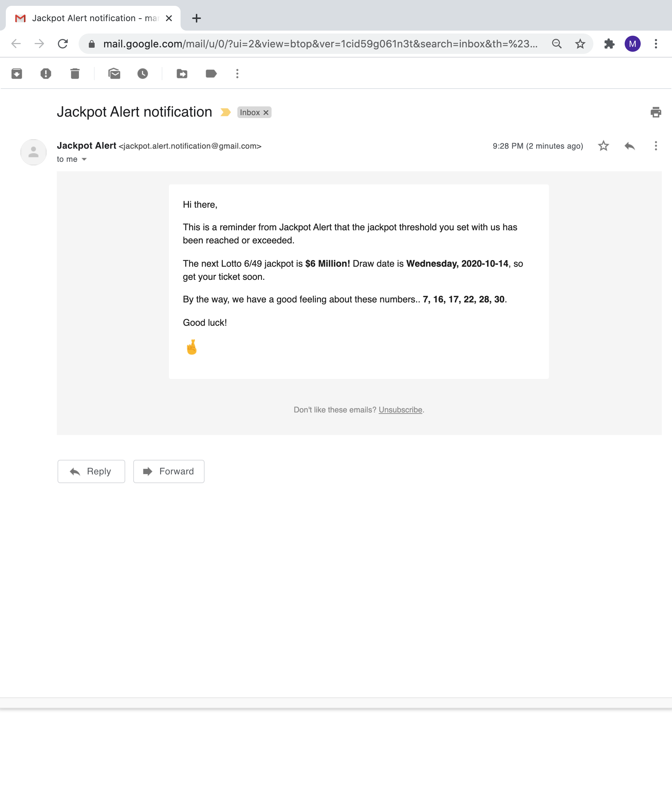
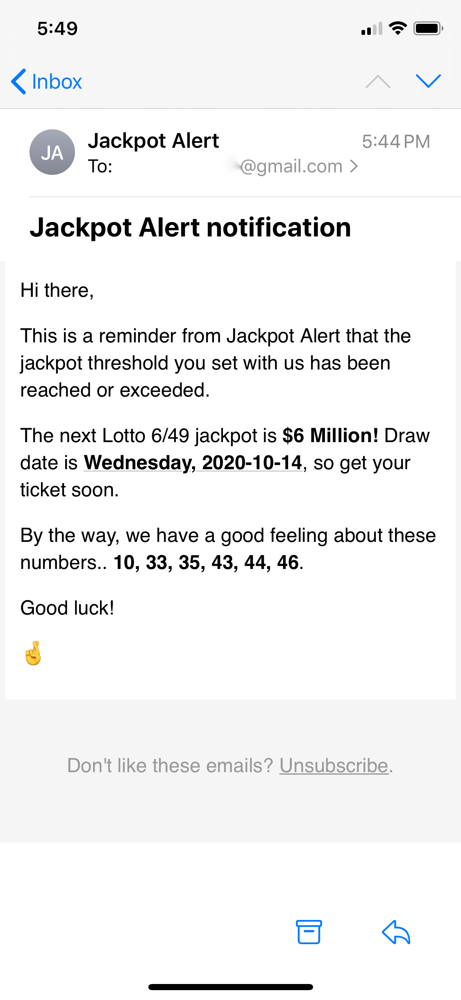

# Jackpot_Alert

This is a program that notifies users via email/text of lottery jackpots with grand prizes larger than a specified threshold. Never miss a big jackpot again!

## About The Project

Like many, I like to play the lottery once every once in a while. The only problem is that since I don't keep a close eye on lottery news or follow the gaming commission on Twitter, I often miss big jackpots that draw crowds to local convenience stores. I built Jackpot Alert to solve this exact problem - notify me when a jackpot has reached a certain size so I can throw my name into the (very very large) hat as well. 

### Here's how to sign up:

On the home page, the user first enters jackpot thresholds for the lotteries that they would like to be notified for. Then, the user can enter their preferred form of contact, email and/or phone. Lastly, the user can check whether or not they'd want suggestions on which lucky numbers to buy, generated by Python's trusty `random` module. 

If the user enters something incorrectly by accident, the form will provide some feedback on what should be entered to properly submit.

Once the user has entered all their information correctly and they hit submit, they'll be greeted with a success page confirming that their information has been recorded. Simple!

### Here's what notifications look like:

Notifications will be sent 2 days before the drawing if the jackpot exceeds a user's threshold. The notifcations will tell the user what the upcoming jackpot amount is and what the draw date will be. If the user opted in to recieve "lucky numbers", then that will also be included in the email as well. 

Email notifications on web and mobile:

-->

Text alerts:

And voila, that's it!

## Technical details

This project was built primarily using Python.

Front-end:
* Flask and WTForms for user input
* Bootstrap for styling

Back-end:
* Text notifications are generated using Twilio's API
* Emails sent using Python's `smtplib` library
* SQLite database
* Beautiful Soup for scraping latest lottery jackpots and details

Project currently just runs locally, but I am looking at options for deployment in the future.

#### Thanks for checking out my project! :wave:

